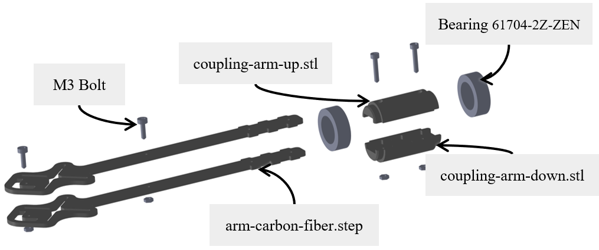
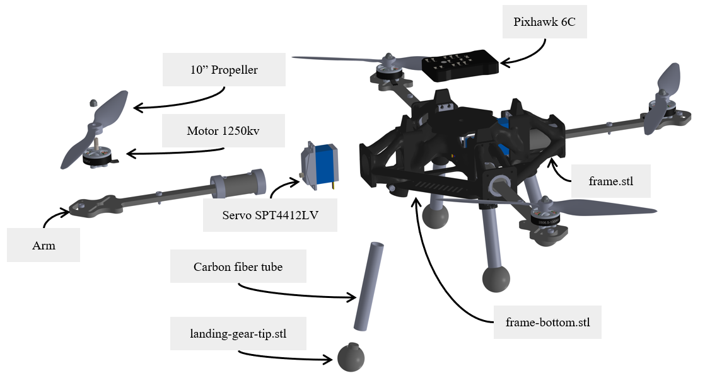

# OmniQuad Design

This folder contains the files to build the OmniQuad presented in the paper "Design and Control of an Omnidirectional Aerial Robot with 4DoF Haptic Joystick for Physical Interaction". The objective is to improve reproducibility in robotics, by providing an haptic remote controller for a telemanipulation system.

Freeflight           |  Physical interaction
:-------------------------:|:-------------------------:
  |  

## Overview

Omnidirectional platforms are complexe machines with a lot of components, requiring substantial maintenance due to the complexity of their systems and current manufacturing techniques. Here we propose an optimized robot design with a reduced number of parts and 3D printed parts. We first present the design of the tilting arm, then we show how it is mounted on the full robot.

## OmniQuad Tilting Arm

The tilting platform arm proposes to simplify the rotor mounting. Instead of using tubular shape, here we propose to directly link the motor to a two sheets of 3mm carbon fiber. These CNC cut arms are attached with bolts, and their shape is presented bellow.

### 3D print and CNC cut

The revolut joint is done with two coupling parts that link the carbon fiber arm. The experience showed that PETG was the material to use, combining ease to manufacture and resilience:

- [Coupling arm up](parts/coupling-arm-up.stl) x 4
- [Coulping arm down](parts/coupling-arm-down.stl) x 4
- [Arm carbon fiber](parts/arm-carbon-fiber.step) x 8

### Others

The previously presented 3D printed parts clamp the carbon fiber sheets while ensuring support for the bearing. The servo actuators are attached to this coupling arm mechanism.

- 61704-2Z-ZEN bearings x 8
- M3 L25 bolts x 8
- M3 L12 bolts x 8

## OmniQuad full

The robot chassis is the core component. The design we propose reduces the overall wheight of the robot while keeping rigidity against internal stress. The other parts are all attach around it.

### Upper part

Different materials have been tested, and the tough PETG is the one keeping a certain rigidity with resonable resilience to impacts. The frame links the arms that are secured with some caps. The latters are screwed into the frame and press the arm to lock it firmly againt the servo motors.

- [Frame](parts/frame.stl)
- [Cap](parts/cap-arm.stl) x 4
- M3 L10 screws x 16
- SPT4412LV servo  x 4
- M3 L8 screws x 16

### Bottom part

After having installed the tilting mechanism, the ESC can be mounted on the bottom of the frame. This has to be screwed to close the robot frame, while the gears made with the tubes of carbon fiber close the structure. Flexible tip, printed out of TPU, are mounted to the other end of the rod

- [Bottom frame](parts/frame-bottom.stl)
- [Tip landing gear](parts/landing-gear-tip.stl)

### Electronics and other

Here we use a Pixhawk flight controller to flash our custom version of [PX4](https://github.com/tilties2/PX4-OmniQuad). Propellers have to be 10" and motors of 1250-1300kv

- Pixhawk 6C
- 10x4.5 propellers x 4
- iFlight XING2 2809 1250KV brushless motors x 4